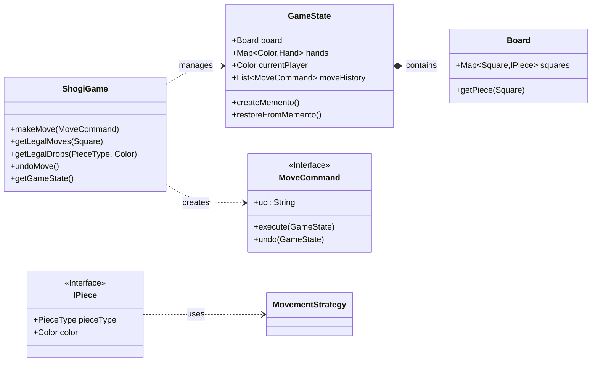
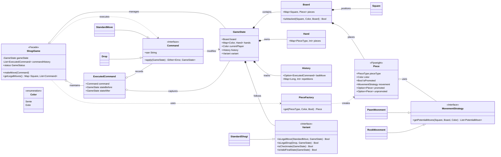
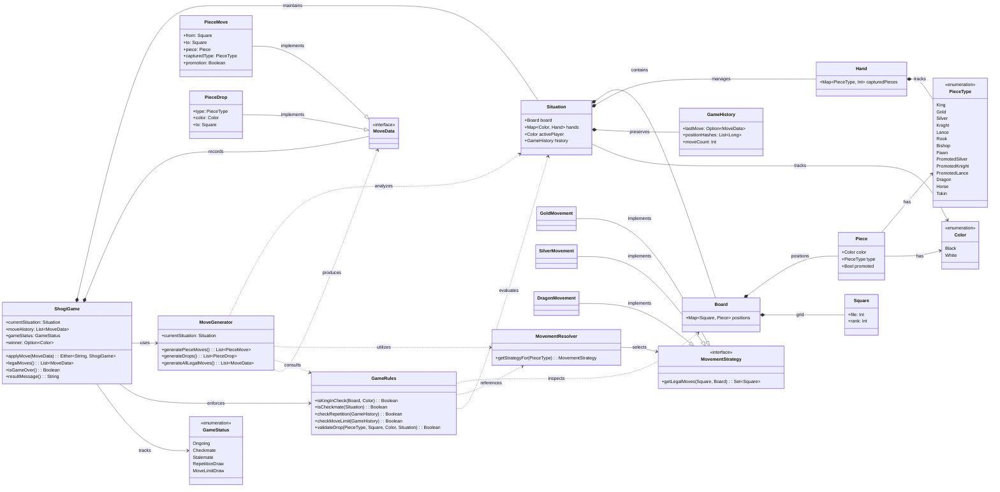

Chess API written in scala for [lichess.org](https://lichess.org)

It is entirely functional, immutable, and free of side effects.

INSTALL
-------

Clone scalachess

    git clone https://github.com/lichess-org/scalachess

Start [sbt](http://www.scala-sbt.org/download.html) in scalachess directory

    sbt

In the sbt shell, to compile scalachess, run

    compile

To run the tests

    testKit / test

To run benchmarks (takes more than 1 hour to finish):

    bench / Jmh / run

Or to output a json file

    bench / Jmh / run -rf json

To run quick benchmarks (results may be inaccurate):

    bench / Jmh / run -i 1 -wi 1 -f1 -t1

To run benchmarks for a specific class:

    bench / Jmh / run -rf json .*PlayBench.*

To run [scalafmt](https://scalameta.org/scalafmt/docs/installation.html) and [scalafix](https://scalacenter.github.io/scalafix):

    sbt prepare

Install (python)
-------
For python code, [install pipenv](https://pipenv.pypa.io/en/latest/installation.html#installing-pipenv), and run `$ pipenv install` from project root.
