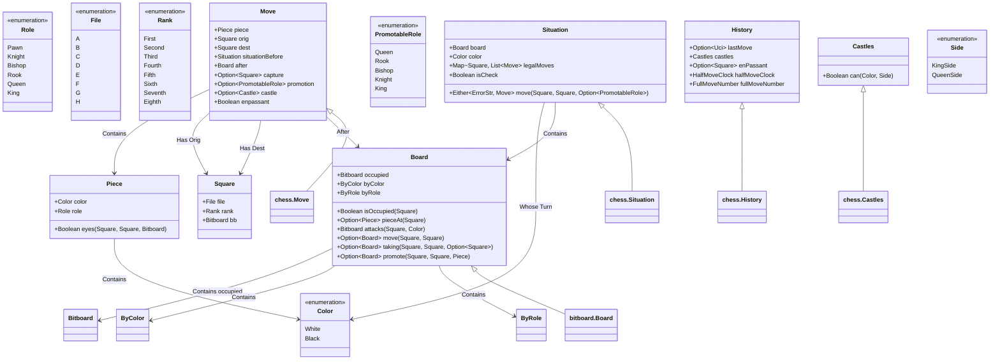

```mermaid
classDiagram
    class Board {
        +Bitboard occupied
        +ByColor byColor
        +ByRole byRole
        +Boolean isOccupied(Square)
        +Option~Piece~ pieceAt(Square)
        +Bitboard attacks(Square, Color)
        +Option~Board~ move(Square, Square)
        +Option~Board~ taking(Square, Square, Option~Square~)
        +Option~Board~ promote(Square, Square, Piece)
    }

    class Piece {
        +Color color
        +Role role
        +Boolean eyes(Square, Square, Bitboard)
    }

    class Color {
        <<enumeration>>
        White
        Black
    }

    class Role {
        <<enumeration>>
        Pawn
        Knight
        Bishop
        Rook
        Queen
        King
    }

    class Square {
        +File file
        +Rank rank
        +Bitboard bb
    }

    class File {
        <<enumeration>>
        A
        B
        C
        D
        E
        F
        G
        H
    }

    class Rank {
        <<enumeration>>
        First
        Second
        Third
        Fourth
        Fifth
        Sixth
        Seventh
        Eighth
    }

    class Move {
        +Piece piece
        +Square orig
        +Square dest
        +Situation situationBefore
        +Board after
        +Option~Square~ capture
        +Option~PromotableRole~ promotion
        +Option~Castle~ castle
        +Boolean enpassant
    }

    class PromotableRole {
        <<enumeration>>
        Queen
        Rook
        Bishop
        Knight
        King
    }

    class Situation {
        +Board board
        +Color color
        +Map~Square, List~Move~ legalMoves
        +Boolean isCheck
        +Either~ErrorStr, Move~ move(Square, Square, Option~PromotableRole~)
    }

    class History {
        +Option~Uci~ lastMove
        +Castles castles
        +Option~Square~ enPassant
        +HalfMoveClock halfMoveClock
        +FullMoveNumber fullMoveNumber
    }

    class Castles {
        +Boolean can(Color, Side)
    }

    class Side {
        <<enumeration>>
        KingSide
        QueenSide
    }

    %% Relationships
    Board --> Bitboard : Contains occupied
    Board --> ByColor : Contains
    Board --> ByRole : Contains
    Piece --> Color : Contains
    Move --> Piece : Contains
    Move --> Square : Has Orig
    Move --> Square : Has Dest
    Move --> Board : After
    Situation --> Color : Whose Turn
    Situation --> Board : Contains

    Board <|-- bitboard.Board
    Move <|-- chess.Move
    Situation <|-- chess.Situation
    History <|-- chess.History
    Castles <|-- chess.Castles

```
